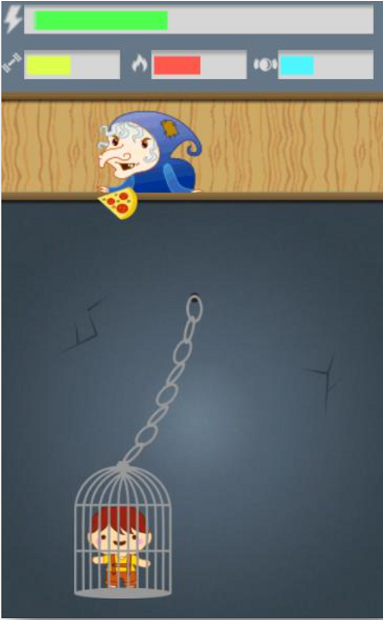

# Gretel
A serious game to teach the right food choices while having fun.
Based on the fairy tale of Hansel & Gretel, developed during a 48 hour game jam with Unity.
The player can move the cage in order to grab the right food to keep all the levels bar balanced.
The bars indicate the three macronutrients needed for living: carbs, fats and proteins.

